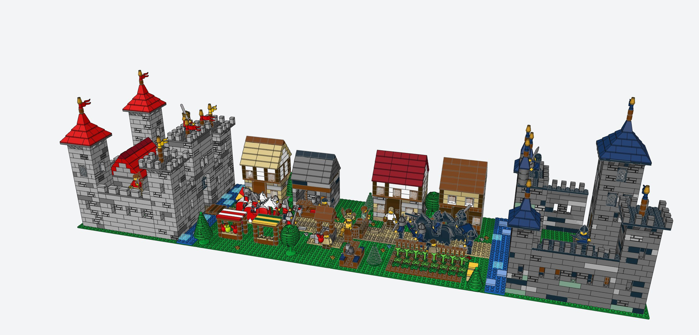
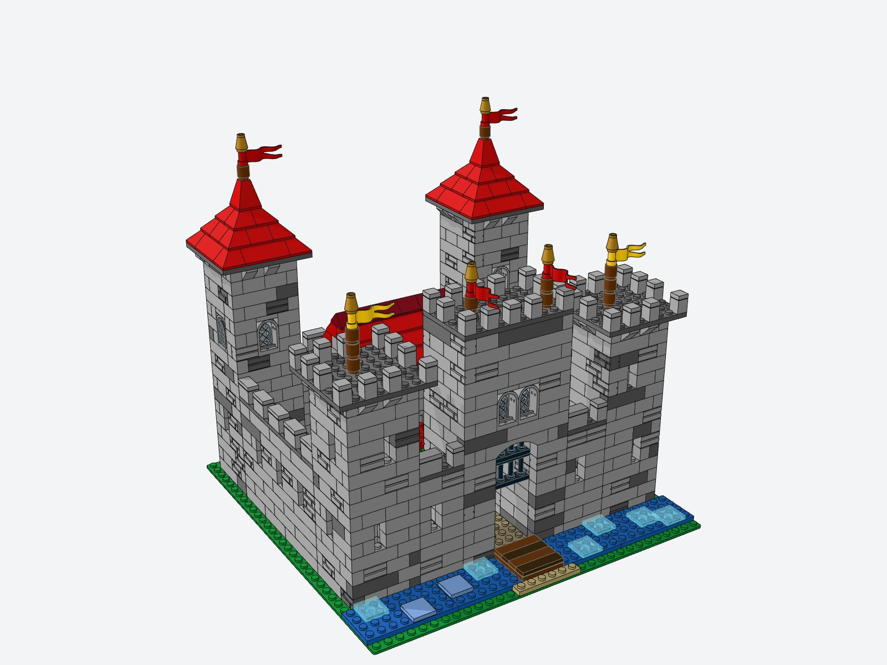
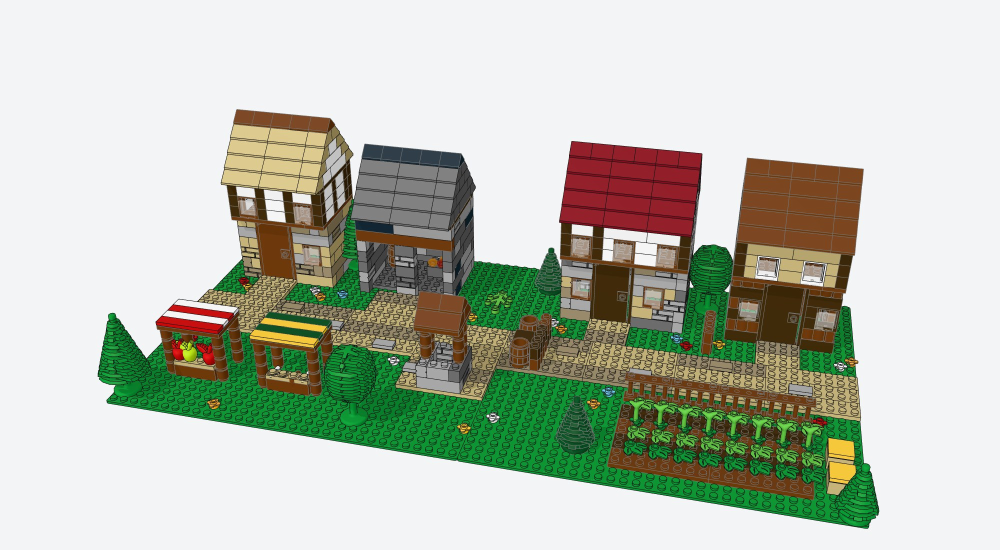
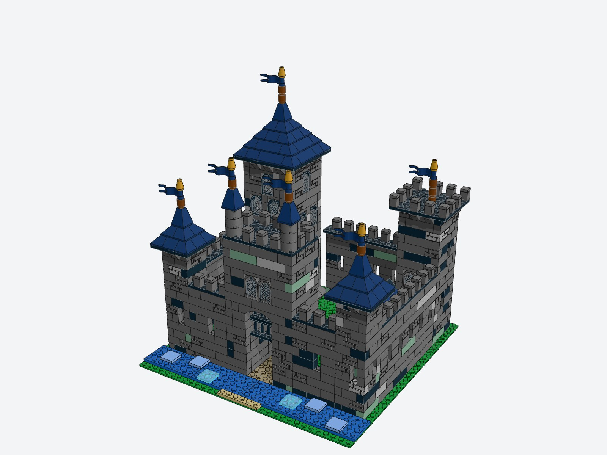
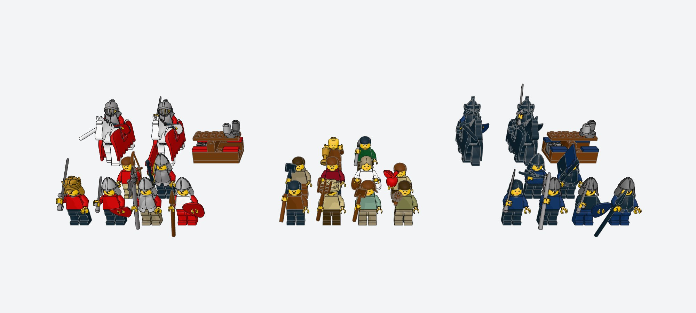
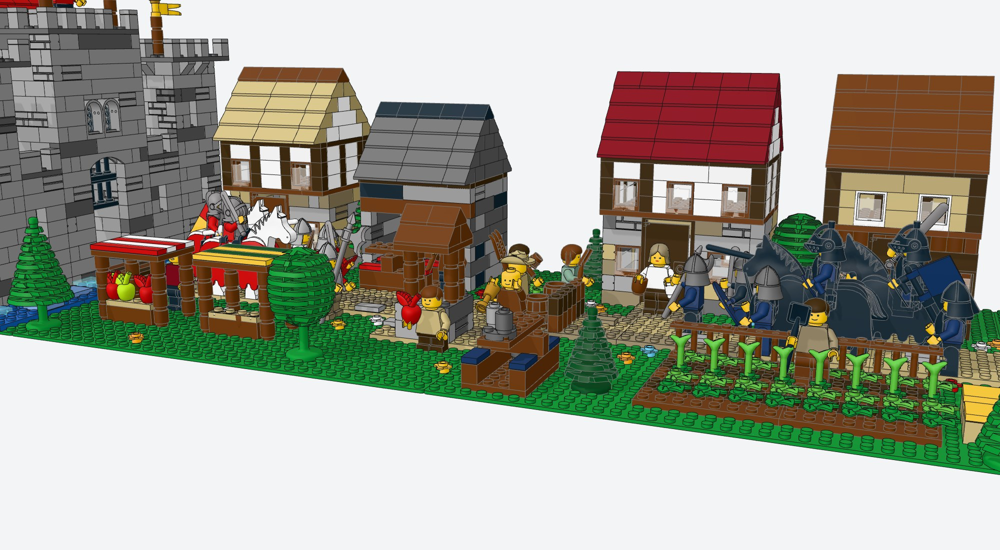

# Nobles & Common Folk at Quarrel



A brick-built LEGO® castle diorama in four books: two rival castles, the village caught
between them, and three armies (two noble, one common) clashing on the village road.

**3,528 pieces · 26 minifigures · 4 horses · 2 catapults · 128 × 32 studs (about 102 × 26 cm) ·
about $430 of BrickLink parts (budget: $500)**

| | |
|---|---|
| **Interactive 3D viewer** | [Open the 3D viewer](https://claude.ai/artifact/1EPV1mjvLhD8HNA5NgNJmp) (private until you share it), or run [`viewer/`](viewer) locally |
| **Building instructions** | [`instructions/`](instructions): four PDF booklets, 322 steps |
| **BrickLink order** | [`bricklink/wanted_list_complete.xml`](bricklink/wanted_list_complete.xml) and the [ordering guide](bricklink/ORDERING.md) |
| **Digital model** | [`models/`](models): LDraw files for BrickLink Studio, LeoCAD and LDCad |

## The story

For three generations **House Aurelion**, the Crimson Lions of Lionhold, and **House Corvane**, the
Black Ravens of Ravencrag, have claimed the valley between their walls. Both houses tax Millbrook,
the village on the only road that joins them. This spring Duke Aldric sent his knights east and
Baroness Morwen sent hers west, and they met in the village square.

The villagers had had enough. Bram the blacksmith, Hob the farmer and their neighbours rolled out
barrels, crates and logs, barricaded the road, and now stand with pitchforks, shovels and torches
between the two armies. Brother Anselm raises the chalice and begs everyone to go home. Nobody is
listening yet.

## What's in the set

| Book | Model | Pieces | Steps | Est. parts cost | Instructions | Wanted list |
|---|---|---:|---:|---:|---|---|
| 1 | **Lionhold**, castle of House Aurelion | 1,263 | 110 | $118.63 | [PDF](instructions/book1_lionhold.pdf) | [XML](bricklink/wanted_list_book1_lionhold.xml) |
| 2 | **Millbrook**, village of the common folk | 872 | 72 | $108.37 | [PDF](instructions/book2_millbrook.pdf) | [XML](bricklink/wanted_list_book2_millbrook.xml) |
| 3 | **Ravencrag Keep**, stronghold of House Corvane | 1,094 | 102 | $113.33 | [PDF](instructions/book3_ravencrag.pdf) | [XML](bricklink/wanted_list_book3_ravencrag.xml) |
| 4 | **Warriors & Weapons**: figures, horses, catapults | 299 | 38 | $89.30 | [PDF](instructions/book4_warriors.pdf) | [XML](bricklink/wanted_list_book4_warriors.xml) |
| | **Complete set** | **3,528** | **322** | **$429.64** | | [XML](bricklink/wanted_list_complete.xml) |

The four 32 × 32 baseplates sit in a row, and the road lines up across all of them:

```
 x:  0            32                              96           128
     +------------+---------------+---------------+------------+
     |  LIONHOLD  |   MILLBROOK   |   MILLBROOK   | RAVENCRAG  |
     |  (Book 1)  |  west (Bk 2)  |  east (Bk 2)  |  (Book 3)  |
     |   gate  >==|=== road ======|===== road ====|==<  gate   |
     +------------+---------------+---------------+------------+
                          viewer / front of the display
```

### Book 1 · Lionhold



A light-grey stone castle with four corner towers. The two towers at the back carry red pyramid
spires about 22 cm tall. The gatehouse faces the village and has a lowered drawbridge over a moat, a
portcullis hanging in the gate passage, and a gate room with lattice windows. Inside the walls are a
Great Hall with a red roof and an arched entrance, a stable lean-to, and wall-walks with battlements
all the way round. The walls mix plain and masonry-profile bricks with random dark-grey stones for a
weathered look, and the towers use inverted slopes as corbels under their overhanging tops.

### Book 2 · Millbrook



The village spreads over two baseplates:

* the Miller's cottage with a thatched roof
* the blacksmith's forge with glowing coals, anvil and a slate roof
* *The Quarrelsome Boar* tavern
* the woodcutter's log house

Each house has a stone or log ground floor and a jettied, timber-framed upper storey. The rest of the
village is two market stalls with striped awnings, the village well, a fenced carrot and cabbage
field, hay bales, trees and flowers, and the commoners' barricade in the middle of the road.

### Book 3 · Ravencrag Keep



The rival stronghold is built from dark stone with black and moss-green weathering, and has a
different silhouette from Lionhold. A tall donjon sits on a sloped plinth, with its door raised above
a flight of steps. Its dark-blue spire tops out at about 24 cm. The gatehouse carries two pepper-pot turrets, and
two small corner turrets and a battlemented tower complete the walls. The courtyard holds a barracks
with a dark-blue roof, weapon crates and barrels.

### Book 4 · Warriors & Weapons



| House Aurelion (Lions) | Millbrook (common folk) | House Corvane (Ravens) |
|---|---|---|
| Duke Aldric Aurelion with crown, cape and greatsword | Bram the blacksmith with his hammer | Baroness Morwen Corvane with cape and longsword |
| Sir Leofric, mounted, with couched lance | Hob the farmer with a pitchfork | Sir Mordred, mounted, with couched lance |
| Sir Gawyn, mounted, with sword | Maud the farmwife with a shovel | Sir Corwin, mounted, with greatsword |
| Man-at-arms, halberdier, spearman | Wat with a torch, Tom with a shovel | Axeman, swordsman, spearman |
| Archer on the wall-walk | Guy the merchant, Agnes of the tavern | Crossbowman on the wall-walk |
| Standard-bearer with the red and gold banner | Pip the stable boy, Ned the woodcutter | Standard-bearer with the blue and black banner |
| 2 white battle horses with red barding | Brother Anselm, the peacemaker | 2 black battle horses with black barding |
| Catapult | | Catapult |



More views: [overhead battle map](renders/diorama_overhead.jpg) ·
[looking west from Ravencrag](renders/diorama_from_ravencrag.jpg)

## Building it

1. Order the parts (see below). You can buy book by book.
2. Build the books in order: 1 Lionhold, 2 Millbrook, 3 Ravencrag, 4 Warriors. Each booklet starts
   with a parts inventory. Every step shows the new parts in full colour, with earlier parts faded,
   and a call-out box listing exactly what to add.
3. Put the four baseplates in a row as in the layout above, then stage the battle using the diorama
   renders as a guide (`renders/diorama_overhead.jpg` shows where everyone stands).

## Ordering the parts

Upload [`bricklink/wanted_list_complete.xml`](bricklink/wanted_list_complete.xml) at
**BrickLink → Want → Upload**, then use **Buy All** to pick shops. The full walkthrough, the budget
breakdown and the substitutes for a few rarer items (dark blue roof slopes, plain horse barding,
capes) are in [`bricklink/ORDERING.md`](bricklink/ORDERING.md).
[`bricklink/parts_list.csv`](bricklink/parts_list.csv) lists every lot with its BrickLink ID, colour,
quantity per book and estimated price.

Prices are **estimates** based on typical BrickLink prices. Shipping is extra (usually $20–45 when
the order is split across a few shops).

## The digital model

* `models/1_lionhold.ldr`, `2_millbrook.ldr`, `3_ravencrag.ldr`: one file per building, with the
  building steps.
* `models/4_warriors.mpd`: all figures, horses and catapults lined up, each as its own sub-model.
* `models/nobles_and_common_folk_diorama.mpd`: everything in place, battle included.

These are standard LDraw files. BrickLink Studio imports them directly
(*File → Import → Import LDraw*) and can generate its own instructions and wanted list from them.

**Viewer on your own computer:** `cd viewer && python3 -m http.server 8000`, then open
<http://localhost:8000>. The viewer needs to be served over HTTP, because opening `index.html`
straight from disk blocks the model download.

## How it was made

The set is generated by the Python code in [`tools/`](tools):

* `lego.py` is a small modelling kernel. It places real LDraw parts on the stud grid, refuses
  overlapping parts, and checks that every brick is connected to the baseplate through stud
  connections.
* `kit.py` holds the techniques: running-bond walls with interlocking corners, battlements,
  corbelled tower tops, pyramid and gable roofs, and timber-framed houses.
* `lionhold.py`, `millbrook.py`, `ravencrag.py` and `warriors.py` are the four books, and
  `diorama.py` places everything for the battle scene.
* `catalog.py` / `bom.py` map LDraw parts to BrickLink IDs and colours and estimate prices.
* `instructions.py`, `booklet.py` and `render/` render every step with three.js' LDraw loader in
  headless Chromium and lay out the PDF booklets.

Part geometry comes from the [LDraw parts library](https://library.ldraw.org) (CCAL 2.0).

## Notes

* This is a digital design. The generator verifies collisions and stud connections, but the model
  has not been built physically yet, so a few spots may need small tweaks. A few parts are held in
  ways the stud checker does not model (window panes and doors in their frames, the portcullis
  fences, barrels), so they were placed by hand.
* Minifigure parts are listed as separate pieces (torso, arms, hands, hips and legs, head,
  headgear). Many sellers also offer the torso ready assembled with arms and hands.
* LEGO® is a trademark of the LEGO Group, which does not sponsor, authorise or endorse this fan
  design.
